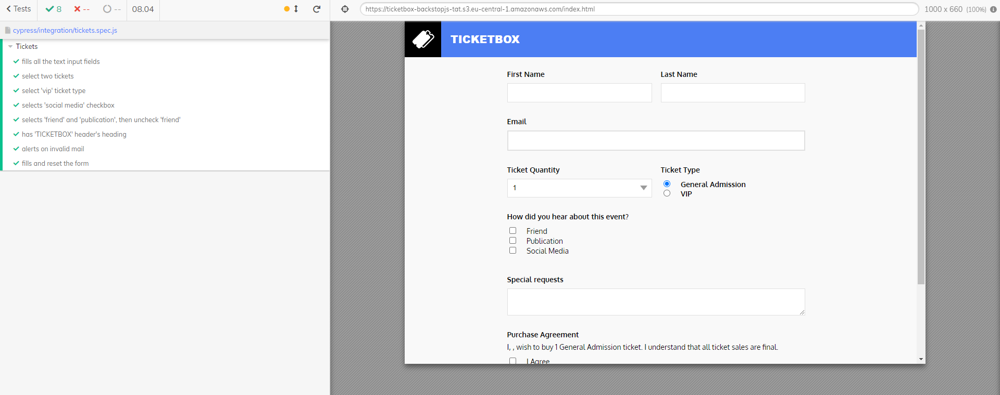

# Cypress Na Prática

Aplicação de automação de testes usando Cypress e JS.

Tecnologias utilizadas: Cypress + JavaScript

 
  

  &#xa0;

  <a href="#dart-sobre">Sobre</a> &#xa0; | &#xa0;   
  <a href="#rocket-tecnologias">Tecnologias</a> &#xa0; | &#xa0;
 

 

## :dart: Sobre ##

Cypress é um framework muito utilizado para automatizar testes web. Essa aplicação foi feita para testar o site: https://ticketbox-backstopjs-tat.s3.eu-central-1.amazonaws.com/index.html

## :rocket: Tecnologias ##

As seguintes ferramentas foram usadas na construção do projeto:

- [Cypress](https://www.cypress.io/)
- [JavaScript](https://developer.mozilla.org/pt-BR/docs/Web/JavaScript)

<a href="#top">Voltar para o topo</a>

